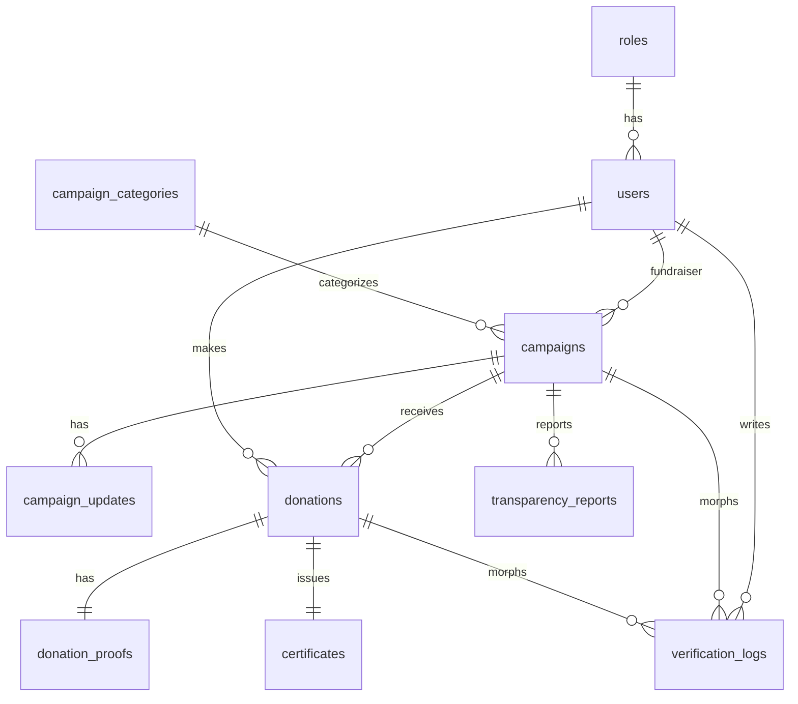

# Platform Donasi dan Crowdfunding Lokal Yayasan Sosial Sumsel Peduli

Aplikasi web fullstack berbasis **Laravel 12**, Blade, Tailwind CSS, MySQL, Laravel Mail, dan DomPDF untuk penggalangan dana sosial lokal wilayah Sumatera Selatan. Sistem sengaja memakai **transfer bank manual**: donatur wajib mengunggah bukti transfer dan admin memverifikasi sebelum dana dihitung ke progress campaign.

## Fitur Utama

- Autentikasi ala Laravel Breeze: login, register, forgot password, email verification-ready.
- Role-based access control: `admin`, `fundraiser`, `donor` melalui middleware `role`.
- CRUD campaign untuk fundraiser/admin dengan upload thumbnail dan dokumen pendukung.
- Verifikasi campaign oleh admin: approve/reject, catatan admin, audit log.
- Detail campaign publik: storytelling, target, dana terkumpul, progress bar, timeline update, riwayat donasi, transparansi dana.
- Donasi manual: nominal, data donatur, detail bank, upload bukti transfer.
- Verifikasi donasi oleh admin dan update total dana otomatis.
- Sertifikat PDF via DomPDF, download sertifikat, dan dukungan email SMTP.
- Dashboard admin, fundraiser, dan donor.
- Seeder dummy: 3 role, akun demo, 4 kategori, dan 10 campaign.

## Akun Demo

| Role | Email | Password |
| --- | --- | --- |
| Admin | `admin@sumselseduli.test` | `password` |
| Fundraiser | `fundraiser@sumselseduli.test` | `password` |
| Donatur | `donatur@sumselseduli.test` | `password` |

## Instalasi Lokal

```bash
cp .env.example .env
composer install
npm install
php artisan key:generate
php artisan storage:link
php artisan migrate --seed
npm run build
php artisan serve
```

Buka `http://localhost:8000`.

## Catatan Keamanan

- CSRF aktif pada semua form POST/PATCH.
- Throttle login/register/forgot password, donasi, dan route web untuk mengurangi brute force/DoS ringan pada level aplikasi.
- SQL injection dicegah dengan Eloquent ORM dan query builder parameterized.
- Validasi Form Request untuk campaign, donasi, verifikasi, transparansi, serta batas ukuran dan tipe file.
- Upload disimpan di disk `public` Laravel dengan validasi MIME; produksi disarankan memakai object storage private + signed URL untuk bukti transfer.
- Mass assignment dibatasi lewat `$fillable` pada model.
- Audit log verifikasi disimpan di `verification_logs` termasuk admin, action, IP, dan user-agent.
- Password di-hash menggunakan mekanisme Laravel.
- Untuk DDoS besar tetap perlu proteksi infrastruktur: CDN/WAF, rate limiting reverse proxy, monitoring, dan backup.

## ERD Sederhana



## Route List Utama

| Method | URI | Name | Role |
| --- | --- | --- | --- |
| GET | `/` | `home` | Public |
| GET | `/campaigns` | `campaigns.index` | Public |
| GET | `/campaigns/{slug}` | `campaigns.show` | Public |
| POST | `/campaigns/{campaign}/donate` | `campaigns.donate` | Public/Auth optional |
| GET | `/dashboard` | `dashboard` | Auth |
| RESOURCE | `/fundraiser/campaigns` | `fundraiser.campaigns.*` | Fundraiser/Admin |
| GET | `/admin/campaigns` | `admin.campaigns.index` | Admin |
| PATCH | `/admin/campaigns/{campaign}/verify` | `admin.campaigns.verify` | Admin |
| GET | `/admin/donations` | `admin.donations.index` | Admin |
| PATCH | `/admin/donations/{donation}/verify` | `admin.donations.verify` | Admin |
| GET | `/certificates/{certificate}/download` | `certificates.download` | Owner/Admin |

## Iterasi Pengembangan

- **Iterasi 1:** auth, dashboard admin, CRUD campaign, verifikasi campaign, donasi manual, upload bukti transfer.
- **Iterasi 2:** transparansi dana, timeline update, sertifikat PDF, email notifikasi, statistik dashboard, dokumentasi campaign.

## Batasan Proyek

Tidak ada payment gateway otomatis, crypto, NFT, blockchain, marketplace, chat real-time, video call, mobile app, atau multi-tenant system.
